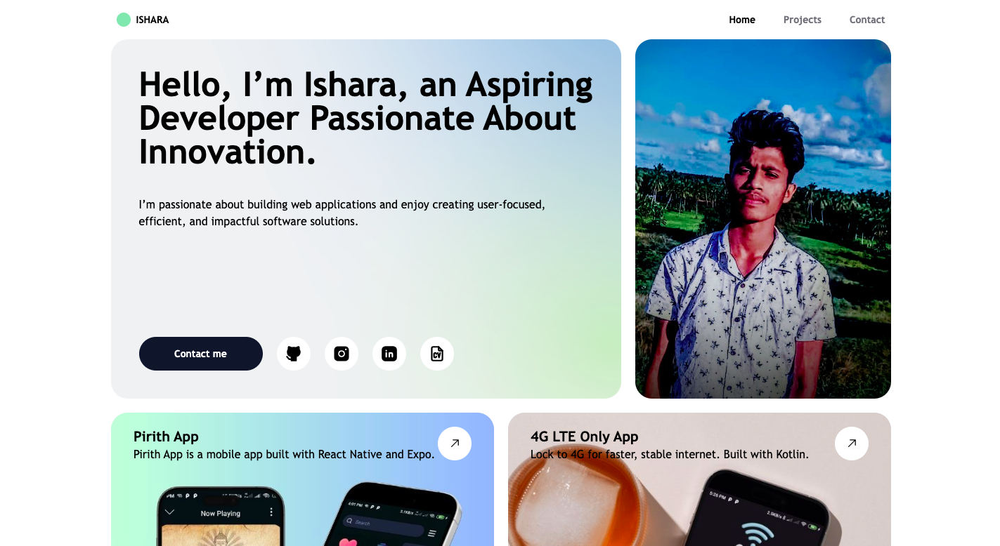

# **Portfolio of Ishara Madushanka Bandara** 💻

Welcome to my **Portfolio**! This repository contains the source code for my personal portfolio website, where I showcase my web development, software development, and UI/UX design projects. Explore my work, including web applications, design prototypes, and more.

---

## **Badges**

  
  
  
[](https://ishara-madu.github.io/)

---

## **Features**

- **Showcase of Projects**  
  A collection of my personal and professional projects, including web development and UI/UX design.

- **Responsive Design**  
  Optimized for viewing across various devices, including mobile, tablet, and desktop.

- **Contact Information**  
  Easy access to get in touch with me through various platforms like LinkedIn, Instagram, and more.

- **Smooth Navigation**  
  Simple and intuitive navigation for a seamless user experience.

---

## **Portfolio Screenshots** 📱

Here’s a preview of my portfolio:

| Homepage                          | Project Page                        | Contact Section                        |
|-----------------------------------|-------------------------------------|---------------------------------------|
|  |  |  |

---

## **How It Works**

1. Open the website to explore my portfolio.  
2. View different sections like **Home**, **Skills**, **Projects**, and **Contact**.  
3. Click on individual projects to get more details about my work.  
4. Use the **Contact** section to get in touch with me for opportunities or collaborations.

---

## **Technical Information**

- **Platform:** Web  
- **Framework:** React.js, Vite  
- **Styling:** Tailwind CSS  
- **Hosting:** GitHub Pages  
- **Dependencies:** React, React Helmet, Vite, Tailwind CSS

---

## **Privacy and Data Usage**

This portfolio does not collect or store any personal information. Any contact form submissions or interaction data are handled securely through third-party services such as EmailJS (if applicable).

---

## **Installation**

To view or contribute to this portfolio:

1. Clone or download the repository.  
2. Install the dependencies using:

   ```bash
   yarn install
   
3. Start the development server:
    ```bash
    yarn dev

4. Open the portfolio on your local machine at http://localhost:3000.

---

## **Installation**

The portfolio is continuously evolving, with future improvements planned

- Adding more interactive projects.
- Enhancing UI/UX with animations.
- Including a blog section to share thoughts and experiences.

---

## **Contact Me**
For any feedback, collaboration opportunities, or inquiries, feel free to open an issue or reach out via email at [isharamadushankab@gmail.com](mailto:isharamadushankab@gmail.com).

---

## **Contributing**
I welcome contributions! Fork the repository, make your changes, and submit a pull request to help improve this **portfolio**.

---

## **License**
This project is licensed under the MIT License - see the [LICENSE](LICENSE) file for details.

---

**Explore my work and get in touch through my portfolio!** 💻